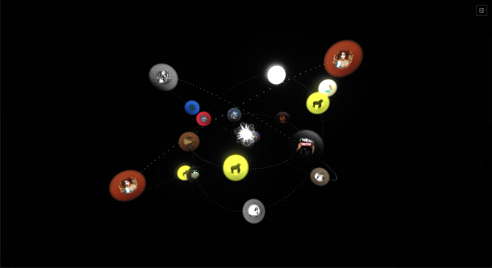

# Crosstalk



A music visualization application that transforms your Spotify tracks into an interactive 3D orbital system. Add songs and watch them orbit around an AI-powered Nucleus that understands your music taste.

## Features

- **3D Orbital Visualization** - Tracks orbit a central nucleus as glass spheres with album art, organized by recency (newest tracks in inner orbits)
- **Spotify Integration** - Import individual tracks or entire playlists via Spotify URLs
- **AI Nucleus Chat** - Interact with an AI personality that knows your music collection and can discuss moods, themes, and connections between tracks
- **Track Analysis** - Each track is analyzed for mood, genre, vocal characteristics, and lyrical content using Gemini AI
- **YouTube Playback** - Play your tracks directly in the app via YouTube audio
- **Lyrics Integration** - Fetches lyrics from Genius for deeper analysis

## Tech Stack

- **Frontend**: React 19, TanStack Router, Three.js, Tailwind CSS
- **Backend**: TanStack Start (Nitro)
- **AI**: Google Gemini API
- **APIs**: Spotify, Genius, YouTube
- **Database**: SQLite (better-sqlite3)
- **Auth**: Better Auth

## Getting Started

1. Clone the repository

2. Install dependencies:
   ```bash
   npm install
   ```

3. Set up environment variables in `.env.local`:
   ```
   SPOTIFY_CLIENT_ID=your_spotify_client_id
   SPOTIFY_CLIENT_SECRET=your_spotify_client_secret
   GENIUS_ACCESS_TOKEN=your_genius_token
   GEMINI_API_KEY=your_gemini_api_key
   BETTER_AUTH_SECRET=your_auth_secret
   ```

4. Run the development server:
   ```bash
   npm run dev
   ```

5. Open [http://localhost:3000](http://localhost:3000)

## Scripts

```bash
npm run dev      # Start development server
npm run build    # Build for production
npm run preview  # Preview production build
npm run test     # Run tests
npm run lint     # Lint code
npm run format   # Format code
```

## How It Works

1. **Add Tracks** - Paste a Spotify track or playlist URL
2. **Analysis** - Each track is analyzed for mood, lyrics, and audio features
3. **Visualization** - Tracks appear as orbiting spheres, with album art rendered on glass-like surfaces
4. **Interact** - Click tracks to see details, click the nucleus to chat with the AI about your collection
5. **Listen** - Play tracks directly via YouTube integration

## License

MIT
